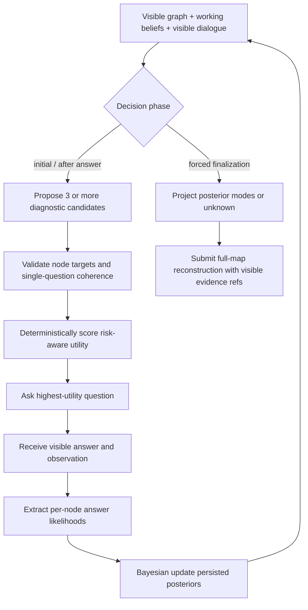

# Evidence-Calibrated Diagnostic Agent Design

## 1. Objective

ECDA reconstructs the hidden node-level Knowledge Map over a fixed reviewed Knowledge Graph. It minimizes expected full-map ordinal risk under a finite number of diagnostic turns while preserving evidence traceability.

Let node (v) have hidden mastery (M_v \in \{L0,\ldots,L5\}), visible history (H_t), and posterior belief (b_t^v(m)=P(M_v=m\mid H_t)). The implementation stores this distribution per node and projects it to the existing categorical working-map contract.

The research objective is:

```text
minimize expected full-map loss + unsupported-inference penalty
subject to turn budget, visibility boundary, and one coherent question per turn
```

## 2. Runtime information boundary

### Inputs allowed

- reviewed Knowledge Graph nodes, edge types, definitions, authored levels, diagnostic goals/signals, and other authored node fields already exposed by the current graph contract;
- current Agent Working Knowledge Map and ECDA posterior fields;
- visible diagnostic questions, answers, coarse observation kinds, and turn IDs;
- decision phase and remaining diagnostic turns.

### Inputs forbidden

- hidden ground-truth map or any derived ground-truth label;
- profile context used to generate it;
- hidden evidence, simulator context, answer blueprints, and simulator traces;
- simulator prompts, hidden confidence, provider internals, or benchmark scoring output during an episode.

## 3. Components

### 3.1 Prior initialization

- New nodes start with a uniform six-level distribution.
- A persisted posterior is reused after resume.
- If ECDA receives a legacy categorical state without a posterior, it reconstructs a conservative peaked prior from mastery plus diagnostic confidence.
- Unknown is epistemic status, not a seventh mastery level. A uniform/flat posterior projects to `unknown`.

### 3.2 Evidence likelihood interpreter

After an answer, the LLM returns only structured node-level evidence:

- node ID;
- likelihood of the observed answer under each mastery level, (P(a_t\mid M_v=m,q_t,H_{t-1}));
- concise observed behavior;
- visible supporting turn IDs;
- contradiction flag.

The LLM does not directly set the final mastery label or confidence. This removes one source of uncontrolled coupling.

### 3.3 Deterministic belief update

For every affected node:

```text
posterior[m] ∝ max(epsilon, likelihood[m]) * prior[m]
```

The result is normalized and persisted in the working-map checkpoint. The implementation derives:

- categorical mastery: posterior mode if commitment threshold is met;
- diagnostic confidence: normalized entropy band;
- unknown: posterior maximum below the commitment threshold;
- contradiction: stored in the evidence note and available for follow-up selection.

This is an approximate Bayesian filter because the likelihoods are LLM estimates. Calibration is evaluated, not assumed.

### 3.4 Candidate question proposal

When another turn is allowed, the LLM proposes at least three candidates. Each candidate contains:

- one coherent user-facing question;
- one primary and zero or more connected secondary target nodes;
- a target mastery boundary;
- estimated information gain;
- graph coverage and graph leverage;
- redundancy and interaction complexity;
- confidence in its answer-outcome estimate.

Candidate constraints:

- target IDs must exist;
- primary target cannot repeat as secondary;
- the task must be answerable as one integrated question;
- no node IDs or L0–L5 labels may be exposed to the user;
- previously asked question IDs are not reused;
- a multi-node probe must target a connected, pedagogically coherent cluster.

### 3.5 Deterministic risk-aware selection

The default surrogate utility is:

```text
U(q) = c(q) * EIG(q)
     + 0.30 * coverage(q)
     + 0.15 * graph_leverage(q)
     - 0.25 * redundancy(q)
     - 0.10 * complexity(q)
```

where all component estimates are in `[0, 1]` and `c(q)` is the outcome-model confidence. Ties are resolved by stable candidate order for reproducibility.

This is deliberately inspectable. The EIG field is still a model-based surrogate; the experiment compares it with fixed, random, coverage-only, direct-LLM, and learned-policy baselines.

### 3.6 Stopping and final projection

- Runtime forced finalization always wins.
- Before forced finalization, ECDA may finalize only when no valid candidate exists; the initial experiment disables learned early stopping to avoid confounding selection quality with stopping policy.
- Final categorical predictions are modes of persisted posteriors above the commitment threshold; diffuse nodes remain `unknown`.
- Non-unknown predictions retain visible supporting turn IDs and concise observed-behavior notes.

## 4. Agent loop



## 5. Why this architecture is the current candidate

| Choice | Evidence basis | Remaining test |
| --- | --- | --- |
| Typed persistent belief | DKVMN, UKT, HierCDF, incremental CD | Does explicit posterior improve ordinal error/calibration over categorical state? |
| Semantic likelihood extraction | OKT, SQKT, option tracing, CIKT | Can an LLM estimate useful likelihoods from free text without circularity? |
| Graph-aware candidate clusters | RKT, RCD, KSCD, GMOCAT | Does it improve coverage without over-propagating mastery? |
| Multiple candidates + deterministic selector | CAT, BALD, core-set | Does the surrogate beat direct LLM question choice at equal call budget? |
| Evidence provenance | interpretable CD, pyKT leakage findings, agent benchmarks | Do citations correspond to genuinely supportive turns under human audit? |

## 6. Prompt architecture

The model-facing contract follows six explicit sections:

1. role and objective;
2. allowed and forbidden inputs;
3. evidence-update or candidate-proposal workflow;
4. decision rules and uncertainty handling;
5. strict JSON schema;
6. self-check before output.

Critical rules include:

- observed behavior must be separated from inferred mastery;
- a likelihood vector may be flat when evidence is ambiguous;
- graph edges are soft diagnostic context, not mastery-copy rules;
- hedging lowers certainty only when it changes demonstrated behavior;
- unsupported nodes remain diffuse/unknown;
- the output is JSON only and cannot contain hidden chain-of-thought.

The actual executable prompt is kept in `backend/knowact/agents/templates/evidence_calibrated.py` so code and parser evolve together.

## 7. Reproducibility requirements

- Agent kind, model, provider, temperature, graph version, hidden-map ID, max turns, and retry count remain immutable in the Episode Manifest.
- Posterior distributions are part of working-map checkpoints.
- Candidate components and selected utility are retained in model output/tool traces where the runtime already records decisions.
- Random baseline selection is seeded deterministically from episode/question-bank identity.
- Formal comparisons reuse exactly the same episode set and simulator snapshots.

## 8. Known limitations

- LLM-produced likelihoods may be poorly calibrated or mutually inconsistent.
- The current selector uses self-estimated candidate utilities rather than a learned answer-outcome model.
- Persisting per-node marginals does not model a full joint distribution across nodes.
- Graph leverage may privilege dense regions unless coverage is stratified.
- A shared model family for simulator and tested agent can create correlated artifacts.

These limitations are experiment targets, not implementation footnotes.
